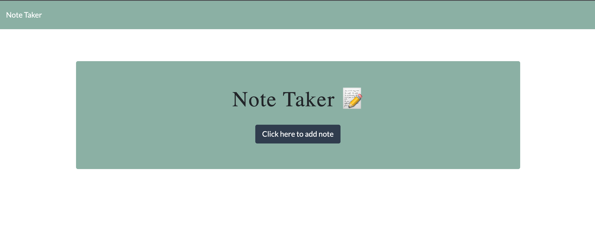

# Note Taker
A Note Taker application can be used to write and save notes. This application uses an Express.js for its back end then savea and retrievea note data from a JSON file.

         <br> 
## User Story
As a small business owner
The user wants to be able to write and save notes
So that they can organize their thoughts and keep track of tasks they need to complete.

## Table of Contents 
1. [About the Project](#About-The-Project)
1. [Project Links](#Project-Links)
1. [Demo](#Demo)
1. [Installation](#Installation)
1. [Usage](#Usage)
1. [Contribution Guidelines](#Contribution-Guidelines)
1. [Project Team](#Project-Team)
1. [Questions](#Questions)
1. [License](#License)

## About The Project

When user opens the Note Taker,
They are presented with a landing page with a link to a notes page.
When user clicks on the link to the notes page, 
Then they are presented with a page with existing notes listed in the left-hand column, 
plus empty fields to enter a new note title and the note’s text in the right-hand column.
When user enters a new note title and the note’s text,
Then a Save icon appears in the navigation at the top of the page.
When user clicks on the Save icon,
Then the new note user have entered is saved and appears in the left-hand column with the other existing notes.
When user clicks on an existing note in the list in the left-hand column,
Then that note appears in the right-hand column.
When user clicks on the Write icon in the navigation at the top of the page,
Then user is presented with empty fields to enter a new note title and the note’s text in the right-hand column.


## Project Links
[Repo Link](https://github.com/SepidehAyani/note_taker) <br>
[GitHub Project Link](https://github.com/SepidehAyani/note_taker)

## Demo
[](assets/img/demo.mov)

##### This is a screenshot of the application and how it works: <br>


## Instructions
```  
git clone https://github.com/SepidehAyani/note_taker.git
```

#### Languages and libraries used in this project:
- <p><a href="https://nodejs.org/">Node.js</a></p>
- <p><a href="https://www.npmjs.com/">NPM</a></p>
- <p><a href="https://www.npmjs.com/package/express">Express.js</a></p>
- <p><a href="https://www.npmjs.com/package/inquirer">Inquirer.js</a></p>
- <p><a href="https://www.npmjs.com/package/uuid">uuid</a></p>
- <p><a href="https://getbootstrap.com/">Bootstrap</a></p>
- <p><a href="https://fonts.google.com/">Google Fonts</a></p>

## Usage
- Note Taker allows users to add note's title and description
- Note Taker allows users to save the notes which they don't lose them even if they refresh the page
- Note Taker allows users to delete notes

#### Contribution Guidelines:
```  
Feel free to contribute to this repo by creating issues or sending an email to sepid.ayani@gmail.com
```

## Questions
<details>
    <summary>Contact</summary>
    sepid.ayani@gmail.com
</details>

## Project Team
[SepidehAyani](https://github.com/SepidehAyani) <br>

## License
#### Distributed under the MIT License. See [Choose A License](https://choosealicense.com/) for more details.